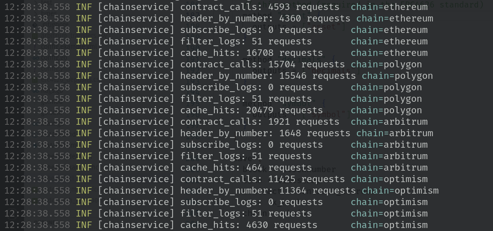
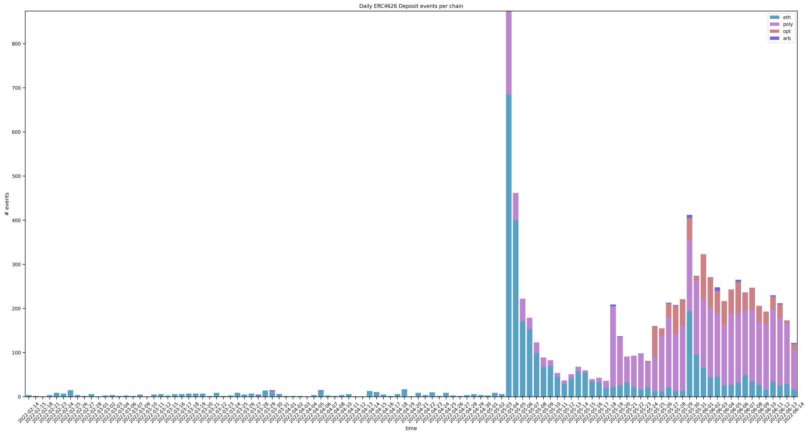
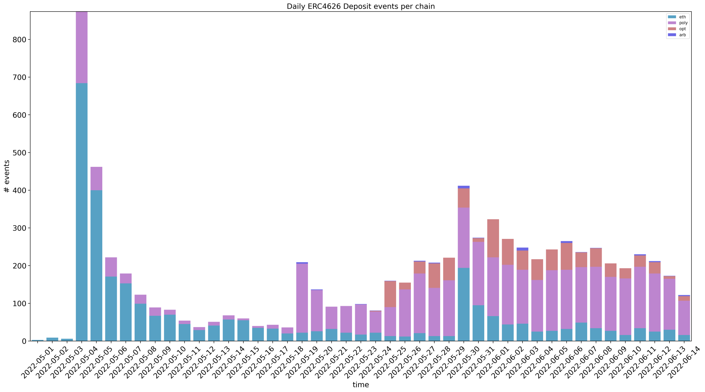
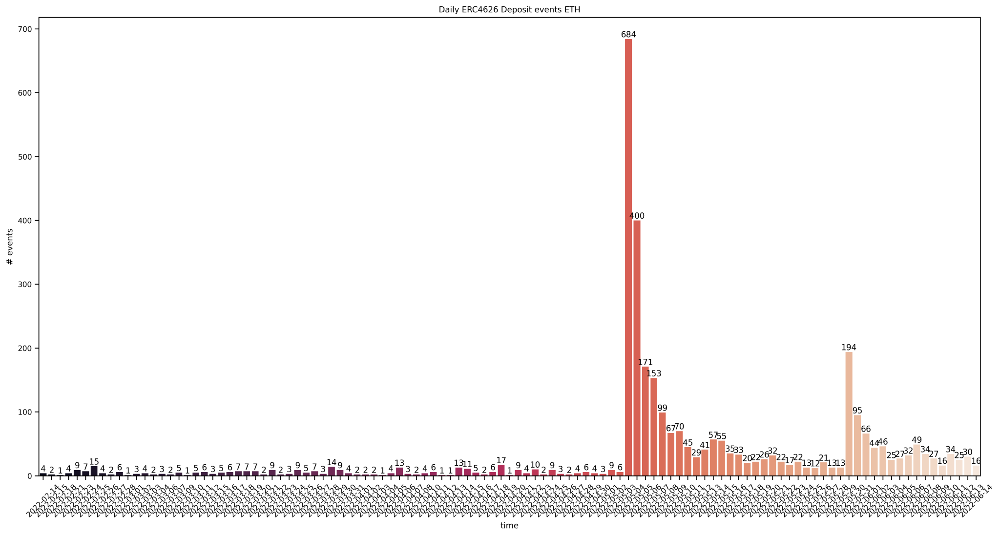
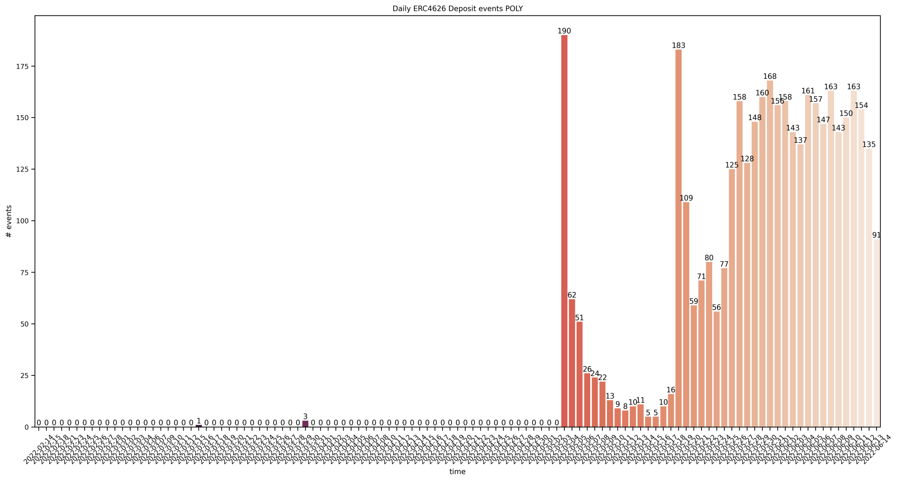
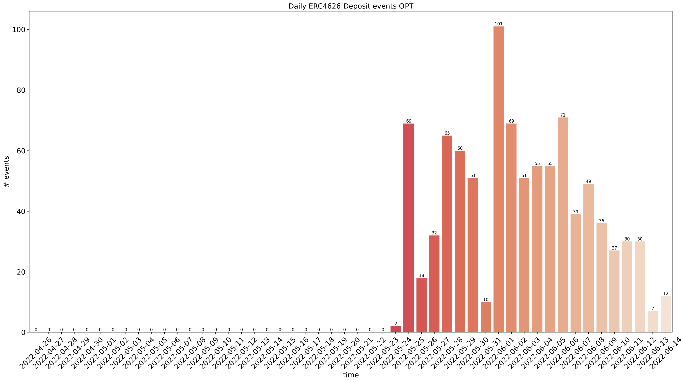

## Introduction
For the last few months, we've been working on [Apollo](https://github.com/chainbound/apollo) 
([docs](https://apollo.chainbound.io)), a tool
to make it easy for anyone to **query**, **filter**, **transform** and **save** EVM chaindata based on a schema.

We built Apollo because we needed to be able to scrape obscure EVM chaindata fast, and the tools currently out there
were too limiting in what they could do. They either run only on a couple chains, or rely on indexing, which is a process
that takes time and is not feasible for just any protocol. **Apollo** interacts directly with the standardized
[JSON RPC API](https://eth.wiki/json-rpc/API) that any EVM node implementation should expose. This means that
as long as you have a JSON RPC API for your chain, **Apollo will be able to run there**. The only other thing
you need is an [ABI](https://www.quicknode.com/guides/solidity/what-is-an-abi).

We believe that the best way to introduce a tool like this is to show its value in a **real world example**.
Inspired by [this tweet](https://twitter.com/boredGenius/status/1533531858591309824), we set about analyzing
the usage of the new [ERC4626 Tokenized Vault Standard](https://eips.ethereum.org/EIPS/eip-4626) across
multiple chains. If you would like to explore more chains, at the
end of the article you will be able to do that yourself, because we are open-sourcing Apollo.
<!--truncate-->


## What is ERC4626?
ERC4626 is a new token standard aims to clear up the problems with having different implementations of tokenized vaults.
One of the most powerful mechanisms in DeFi is **composability**, but composability doesn't work without standards. If you know 
[ERC20](https://ethereum.org/en/developers/docs/standards/tokens/erc-20/) (token standard) or 
[ERC721](https://ethereum.org/en/developers/docs/standards/tokens/erc-721/) (NFT standard), you know how crucial they are. One of the more important products in DeFi are yield-bearing tokenized
vaults. If you've ever staked Sushi in return for xSushi, or deposited ETH on Aave and received aETH, you've used these products.
They represent shares of an underlying token that generate interest over time.
The problem is that when building applications that can integrate with these tokens, you have to build an integration for each
separate implementation. This is complex, error-prone, and resource intensive, resulting in less applications actually doing it. **Bad for composability**.

ERC4626 aims to set a standard for these products called the Tokenized Vault Standard. 
If an application works with ERC4626, it works with any yield-bearing token that 
implements the standard. This will drastically lower the integration effort and will enable a renaissance in DeFi.
It will, for example, provide lending platforms the ability to easily accept any ERC4626 token as collateral,
which would be one example of **composable yield**.

Let's take a look at some of the events and methods of the interface (incomplete), because 
these will be useful later.
```sol title="ierc20.sol"
abstract contract IERC4626 is ERC20 {
    // Emitted every time someone deposits
    event Deposit(address indexed sender, address indexed receiver, uint256 assets, uint256 shares);

    // Emitted every time someone withdraws
    event Withdraw(address indexed sender, address indexed receiver, uint256 assets, uint256 shares);

    // Returns the address of the underlying token
    function asset() external view virtual returns (address asset);

    // Returns the amount of assets managed by the vault
    function totalAssets() external view virtual returns (uint256 totalAssets);

    // Mints `shares` vault tokens by depositing exactly `assets` underlying assets
    function deposit(uint256 assets, address receiver) external virtual returns (uint256 shares);

    // Mints exactly `shares` vault tokens by depositing `assets` underlying assets
    function mint(uint256 shares, address receiver) external virtual returns (uint256 assets);

    // Redeems `shares` from `assets`
    function withdraw(
        uint256 assets,
        address receiver,
        address owner
    ) external virtual returns (uint256 shares);

    // Redeems `shares` from `assets`
    function redeem(
        uint256 shares,
        address receiver,
        address owner
    ) external virtual returns (uint256 assets);

    // Other view functions omitted
    ...
}
```

## Analysis
Since we believe ERC4626 will be a very important building block in future DeFi protocols, we wanted to analyze its usage.
Partly because we live in a multi-chain world, and partly because we want to highlight a competitive feature that **Apollo** has,
we will be looking at 4 chains: **Ethereum**, **Polygon**, **Arbitrum** and **Optimism**. This analysis serves
as an introduction to using Apollo, but you can also just move on to the [results](#results).

### Apollo workflow
This is the game plan: we are going to collect every ERC4626 `Deposit` event (see above) across
the chains, from February 1 until June 14. The problem is that the `Deposit` event signature
is not unique to the ERC4626 event, because it is derived from the event name and its types.
Under the hood, what we're actually filtering for is an event **topic**, which in this case will be
```
keccak256("Deposit(address,address,uint256,uint256)") = 0xdcbc1c05240f31ff3ad067ef1ee35ce4997762752e3a095284754544f4c709d7
```
There are other `Deposit` events that have the same signature, so we need to find a way to filter out the right ones.
With Apollo, we can call methods at the time an event occurs, and the method will be called on the contract that
emitted the event. So to filter out the ERC4626 events, we can call the `asset` method, which is part of the interface.
If this call succeeds, we can be relatively sure the contract is an ERC4626 implementation.
If this call reverts, however, which means that the contract does not adhere to the standard, Apollo will just move on and save nothing.

#### Schema
This is the schema we're going to run:
```hcl title="schema.hcl"
start_time = format_date("02-01-2006 15:04", "01-02-2022 00:00")
end_time = now

loop {
  items = ["ethereum", "polygon", "arbitrum", "optimism"]

  query "erc4626_deposits" {
    chain = item

    event "Deposit" {
      abi = "erc4626.abi.json"
      outputs = ["caller", "owner", "assets", "shares"]

      // This will revert if the contract does not have
      // this method (required in the ERC4626 standard)
      method "asset" {
        outputs = ["asset"]
      }

      method "decimals" {
        outputs = ["decimals"]
      }

      method "symbol" {
        outputs = ["symbol"]
      }
    }

    save {
      block = blocknumber
      time = timestamp
      contract = contract_address
      tx = tx_hash
      // We need the chain to differentiate 
      // the results
      chain = chain

      underlying = asset
      caller = caller
      owner = owner
      assets = parse_decimals(assets, decimals)
      shares = parse_decimals(shares, decimals)
      symbol = symbol
    }
  }
}
```
We first have to define our time range, which we can do with `start_time` and `end_time`. `format_date(fmt, date)` can be used 
to convert a datetime to a UNIX timestamp, according to a format. The `now` variable is provided by the DSL.

Next up, we'll define a `loop` block. For every `item` in `items`, Apollo will create a separate query, with the `item` as a variable.
The name of the `query` (erc4626_deposits), will be the name of our output file / output table. We want to filter every 
`Deposit` event, which we can do by declaring an `event` block with the `Deposit` label. In the event block, we define the ABI
(which can be found in the Apollo config directory, see [setting up docs](https://apollo.chainbound.io/getting-started#setting-up)), 
and the `outputs` we want to save for further processing. These have to match the ABI exactly.

After this, we want to gather some extra information by calling some methods on the contract of interest.
We do that with `method` blocks, which have the method name as a label. Just like in `event`, we define our outputs.
There are 2 blocks that we don't need here, which are `transform` and `filter`, but you can read more on them in the 
[schema docs](https://apollo.chainbound.io/schema/intro#transform). In the `save` block, we define the final format
of our output columns. The `save` block has access to any previous `output` parameters, as well as other event context variables
like `blocknumber`, `timestamp`, `contract_address`, `tx_hash`, and `chain`, which we all want to save.
There are some helper functions available as well, and we'll use `parse_decimals(raw, decimals)` to format
our output.

#### Running
Before running, make sure that every `chain` has a corresponding JSON-RPC API field in your `config.yml`. We suggest using either your own
nodes, or providers like [Alchemy](https://www.alchemy.com) or [Chainstack](https://chainstack.com), because the default public endpoints will not do. 
Even when using a specialized provider, you can get rate limited. This is why we've also provided an option to rate limit Apollo itself. 
For this research, we used Alchemy APIs with the default value of `100`:
```bash
apollo --stdout --csv --log-level 0 --rate-limit 100
```
We managed to not exceed our CU capacity, and not get any timeouts. It took around 5 minutes to collect this data.
If you have your own node, you can crank this number up. When running this with our own [Erigon](https://github.com/ledgerwatch/erigon) 
node and a value of `500`, we managed to collect everything in around 30 seconds.

Internally, Apollo uses primitive caching, and methods like `symbol` and `decimals` are cached for every contract, 
drastically reducing the amount of calls made to the API. At the end of execution, you will see some stats printed for each chain:



### Results
Get the results (8328 lines): [erc4626_deposits.csv](./erc4626_deposits.csv)

#### Daily `Deposit` events per chain
[](./daily-deposits.svg)

As we can see here, ERC4626 adoption on Polygon has been the most succesful, perhaps surprisingly. Since its inception,
Polygon has had 4046 ERC4626 `Deposit` events. Ethereum comes in second
with 3287 events, Optimism third with 939 events, and finally Arbitrum, with only 55 events.
But Ethereum was by far the first with any `Deposit` events at all, we'll come back to that later.

Zooming in to where things become interesting, we can see that usage really started picking up on May 4th.
[](./daily-deposits-zoomed.svg)

This is when both [Thorswap Staking V2](https://docs.thorswap.finance/thorswap/usdthor-token/usdthor/vthor) on Ethereum
and [Aavegotchi wapGHST Staking](https://twitter.com/aavegotchi/status/1522212621285576704) on Polygon went live.
### Protocols
#### Ethereum
Let's start with Ethereum, since it had the first deployments. Focusing in on the daily `Deposit` events on Ethereum,
we get the following chart:
[](./daily-deposits-eth.svg)

Looking at those first deposits and their symbols, we can figure out which protocols spearheaded ERC4626 adoption:

| Symbol          | First_occurence                |   Total_deposits | Tx_hash                                                                 
|:----------------|--------------------|:-----------------|:-------------------------------------------------------------------
| d3CVX           | 2022-02-14 |      58          | 0x3bde42aef1d795ec11a2fdec2508fca880a4a73b4818e743790e6a14b2850b26 
| fei3crvCVX      | 2022-02-23 |     111          | 0xb7d0cc8597c00bdee0363c1a69db236e50e247403315650f8e5c6d76d18720e1 
| tricryptoCVX    | 2022-02-24 |      13          | 0xa116b76522fcf8a5efad14cf8ed4817c2ee6b5bc884b16cf752c6f18b2fc015d 
| d3convex        | 2022-02-24 |      14          | 0x3be7f2ce5ddf77d923ed56b5dd4ddbde64a622e4075984be0a5727e417ec462b 
| fei3crvConvex   | 2022-02-24 |       5          | 0x64dab869db30d6b1f817b09bb8c0b4fd8b89f617f075cf2a86b743768c9a5d5b 
| alusd3crvConvex | 2022-02-25 |       4          | 0xc06d393589da3f911912b97f879c95ed22c345bb1aa208c039b477b4db16912b 
| FRX3CRVCVX      | 2022-02-25 |      18          | 0x946ddcc89737b64ca2598dea0ef9aedf123072804f90f96f437959995ad0a6cc 
| steCRVCVX       | 2022-02-25 |      24          | 0x48e7c4ae4adc241375449b392c58236427758e878c8d5b8aa9a80d6fae0d068f 
| USTwCVX         | 2022-02-25 |      29          | 0x2b8d499ce18b85c52193e03a1292fd833835c8122f1046fa1ce7b4434cbc3b10 
| (re)TOKE        | 2022-03-06 |       1          | 0xddc45b5f98e26d8a0331004fcb753d1bbdc6410295acb05bb201a0702bee9990 
| tsTRIBE         | 2022-03-21 |       5          | 0x1e54269a8673a8620bef3a1c29a0d324ab608d5080e3937bb491a57ccc4344ec 
| wfFEI-8         | 2022-03-22 |       4          | 0xdcc3cb38450972076ff91ba6ef798355635db1bdeba581f409863cda997e83a4 
| TTV             | 2022-03-30 |       1          | 0x7c5cef1e9fa8f2f52a0b7baeb5db83fc85dae357e39c657f2fea3635b1827ada 
| cvxFXSFXS       | 2022-04-05 |      38          | 0x2c1a66d9024c734f3aa204306973d9ecd3d13bd5c84e8ea1c31fa3ea852cf0d3 
| rETHwstETH      | 2022-04-06 |       5          | 0xf8273032e398567741f938c4daf34ece9dd70aaef4fd476728d349b9ca8016f8 
| cvxCRVCRV       | 2022-04-10 |      41          | 0xe542dbe25913ed321485ebd75bea95ee5bcb9e6ccbc3fd6a387f61f82b7f11be 
| WOUSD           | 2022-04-11 |      10          | 0x6ca75d83741ba76c0ead05fb7bc93240472460a601fca1e8e236f976485956bd 
| tsBAL           | 2022-04-19 |       1          | 0xe66b53b0ac06c9617010197d370ed68792aef7a6b30e8bfa200a2f77e7aec1ce 
| tALCX           | 2022-04-19 |       1          | 0x7244feb527877b8d80ae71a4d044423087bbca0d0c52f70ea94df8366be52dbf 
| alETHLp         | 2022-04-19 |       1          | 0xe8310a56c5721598373a936e6ffc04714510011a4fcee729afb142d703954284 
| ALCXETH         | 2022-04-19 |       2          | 0x56ab7cce4626c0d31af10537d75143ca2016b54063677577f0dad5f8dc32ff2b 
| 4626-fFEI-8     | 2022-04-19 |       1          | 0x2985f3271ff49ffaf37931f35cf96a7283fa112f2027cec979b1c454f5b6aa86 
| vTHOR           | 2022-04-25 |    2289          | 0x545638df92ff8743e9eeb004385ff72ed4fdc76d8913b40a2274290e66245fb0 
From this table, we can see that [Convex Finance](https://www.convexfinance.com) were the earliest adopters of ERC4626.
They use it in some of their staking pools, specifically for staking Curve LP tokens. There are other
tokens, like `(re)TOKE` (part of TOKEMAK) which only have 1 deposit over the course of their lifetime, so we're not going to mention those.
If you're looking for that secret single deposit alpha, download the dataset above!
Convex has currently deployed the most ERC4626 vaults.

Next up, we start to see some implementations from the original authors of ERC4626: [Fei Protocol](https://fei.money/).
Tokens like `tsTribe` and `tsBAL` are part of the [Tribe Turbo](https://medium.com/fei-protocol/the-tribe-dao-strongly-believes-that-a-healthy-and-thriving-defi-ecosystem-needs-a-robust-platform-b1faea700dfa)
deployments. They don't seem to be active, though.

`WOUSD` is part of a protocol called [Origin Dollar](https://www.ousd.com), a yield bearing stablecoin. Finally we have
`vTHOR`, which is part of [Thorswap](https://thorswap.finance). On Ethereum, this is by far the most popular ERC4626 vault
by number of deposits.

If we sort by the most active ERC4626 vaults, we get the following table:

| Symbol          |   Number of Deposits |
|:----------------|--------:|
| vTHOR           |    2289 |
| xMPL            |     435 |
| uCVX            |     115 |
| fei3crvCVX      |     111 |
| d3CVX           |      58 |
| imUSD           |      47 |
| cvxCRVCRV       |      41 |
| cvxFXSFXS       |      38 |
| USTwCVX         |      29 |
| steCRVCVX       |      24 |
| FRX3CRVCVX      |      18 |
| d3convex        |      14 |
| tricryptoCVX    |      13 |
| WOUSD           |      10 |
| rETHwstETH      |       5 |
| fei3crvConvex   |       5 |
| tsTRIBE         |       5 |
| wfFEI-8         |       4 |
| ∞-yvWETH-xPYT   |       4 |
| alusd3crvConvex |       4 |
| imBTC           |       3 |
| tsgOHM          |       3 |
| ALCXETH         |       2 |
| 4626-fFEI-8     |       1 |
| alETHLp         |       1 |
| tALCX           |       1 |
| aave2-CLR-S     |       1 |
| tsBAL           |       1 |
| TTV             |       1 |
| Frax3Crv        |       1 |
| D3              |       1 |
| BAUSDC-2206     |       1 |
| (re)TOKE        |       1 |

Aside from Thorswap and Convex, two other very popular ERC4626 deployments are `xMPL` from [Maple Finance](https://maple.finance)
and `uCVX`, a [partnership](https://mirror.xyz/0xE90c74145245B498fef924fAdC7bb34253c7cF90/WEj9OWAbvWMJ1xooZ3SOIAWvkp3k5t_mpOXL6EdyRFM)
between **Pirex** and **Llama Airforce** which allows you to deposit `pxCVX`, a vault for `CVX`. Composability in action!

vTHOR currently manages about $12,7M USD of THOR deposits, and xMPL around $45M of MPL. So even though vTHOR has more deposits,
xMPL manages a lot more assets.

#### Polygon
[](./daily-deposits-poly.svg)
Polygon usage really only started after the deployment of **wapGHST** staking on May 4th.
On May 26th, [mStable](https://mstable.org/) [upgraded](https://medium.com/mstable/mstable-save-gets-erc-4626-upgrade-5d94e64bf694) 
their Save Contracts to implement ERC4626, and deposits stayed consistently high.

Zooming in on the most active vaults, **mStable's** `imUSD` is at the top, followed by `wapGHST`:

| Symbol   |   Number of Deposits |
|:---------|--------:|
| imUSD    |    2124 |
| wapGHST  |    1845 |
| LOL      |      20 |
| eVault   |      18 |
| LOLt     |      14 |
| svUSDC   |      10 |
| swMATIC  |       4 |
| LOLT     |       3 |
| USD+     |       3 |
| swUSDc   |       3 |
| LOLB     |       1 |
| stUSD+   |       1 |

`imUSD` currently manages around $6,5M mUSD, and wapGHST manages $1,7M worth of aPolGHST, which is the Aave token for
Aavegotchi GHST.

We could not find any info on `LOL`, which is a vault for Aave Polygon USDC.
`eVault` was interesting. Most of the `Deposit` events where from [0x2C882729f2710D0b8d23d98199ba9FdA1aF05109](https://polygonscan.com/address/0x2C882729f2710D0b8d23d98199ba9FdA1aF05109),
which turned out to be a mocking contract with LINK as its underlying token.
The real implementation was at [0xff07A39665740eB95E57ccDC3963B026741cC88E](https://polygonscan.com/address/0xff07A39665740eB95E57ccDC3963B026741cC88E),
which is a QiDAO vault for Quickswap WMATIC-QI LP tokens. The contract was only deployed 5 days ago at the time of writing (June 14, 2022).

#### Optimism
[](./daily-deposits-opt.svg)
Optimism had 0 ERC4626 activity until May 24th, when [Rubicon Finance](https://rubicon.finance/) upgraded their tokens to implement the standard.
Aside from Rubicon (the `bath` tokens), there doesn't seem to be a lot of ERC4626 activity:

| Symbol                |   Number of Deposits |
|:----------------------|--------:|
| bathUSDC              |     400 |
| bathOP                |     246 |
| bathETH               |     175 |
| bathDAI               |      38 |
| bathUSDT              |      38 |
| bathSNX               |      30 |
| nukenke               |       5 |
| bathWBTC              |       4 |
| dmoUSDC-Basis-Trading |       2 |
| CSET                  |       1 |

## Conclusion
ERC4626 is definitely picking up some steam, but there aren't many big protocols like Aave or Compound that upgraded their
contracts yet, even though the whole DeFi ecosystem would clearly benefit from it. Kudos to all the protocols that did implement it!

If you want to analyze the data yourself, you can download it here: [erc4626_deposits.csv](erc4626_deposits.csv).
You can also try out Apollo at [github.com/chainbound/apollo](https://github.com/chainbound/apollo), make sure to read the
[documentation](https://apollo.chainbound.io)!

:::caution
Apollo is still alpha software, and there will be bugs. If you find any, please open an issue on Github.
:::